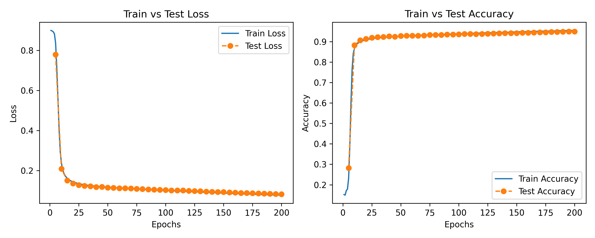
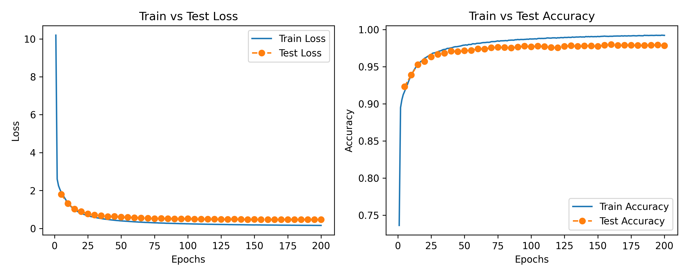
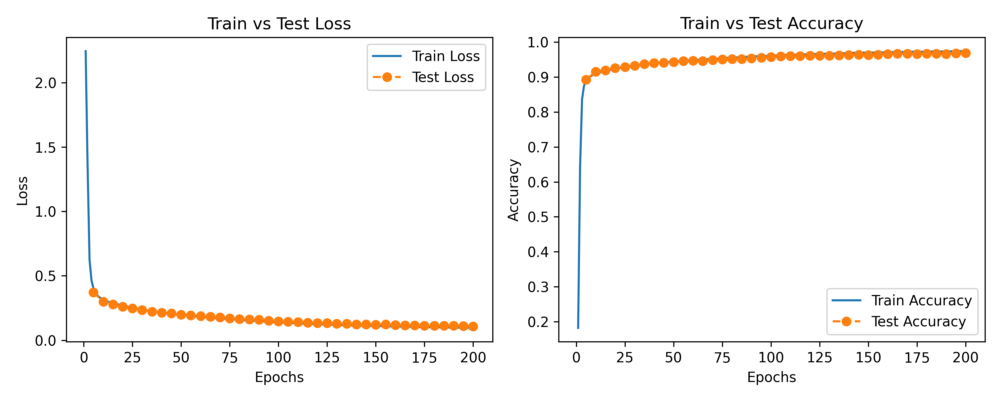
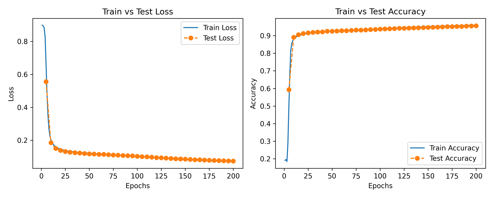
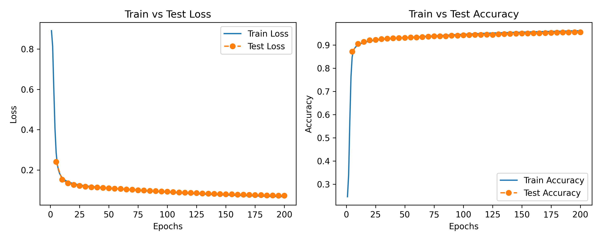
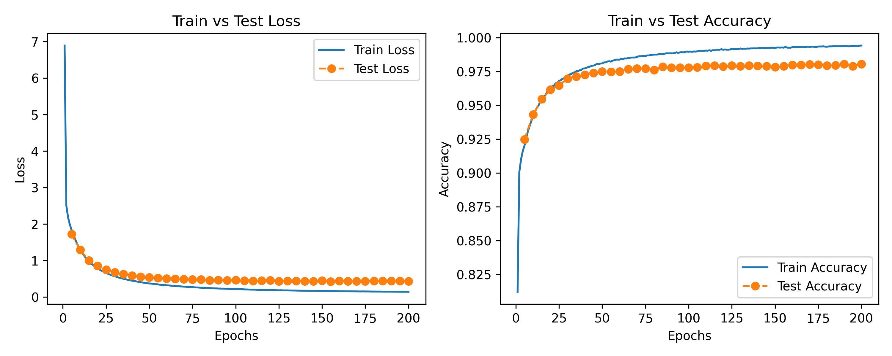
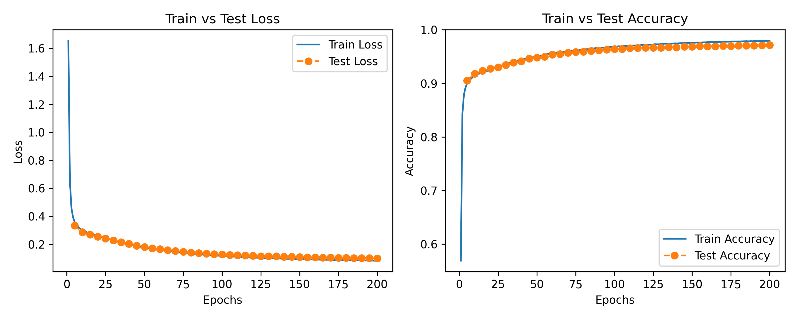
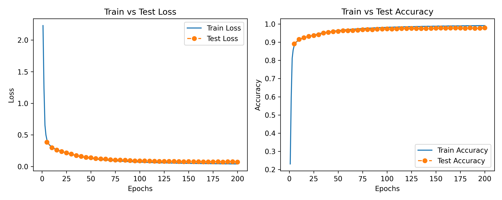

# HW1 Report
本项目对主程序架构进行了修改，并增添了新的函数，详见readme.md

在简单调试后，确定模型超参如下（之后若无特殊说明，超参配置均一致）：
```python
config = {
    "learning_rate": 0.01,
    "weight_decay": 0.001,
    "momentum": 0.1,
    "batch_size": 100,
    "max_epoch": 200,
    "disp_freq": 50,
    "test_epoch": 5,
}
```

在调试过程中，在run_mlp.sh中选择模型架构与超参配置，通过argphase传入主程序

```bash
# run_mlp.sh 主要部分
for act in selu hardswish mish; do
  for loss in sce brier hinge; do
    echo "Running: activation=$act loss=$loss"
    python run_mlp.py \
    --activation $act \
    --loss $loss \
    --hidden1 128 \
    --lr 0.01 \
    --wd 0.001 \
    --mom 0.1 \
    --batch 100 \
    --epoch 200 \
    --trial $trial
  done
done
```


## Single hidden layer
基本网络架构如下
```python
    model = Network()
    model.add(Linear("fc1", 784, args.hidden1, 0.01))
    model.add(get_activation(args.activation))
    model.add(Linear("fc2", args.hidden1, 10, 0.01))
    loss = get_loss(args.loss)
    arch = f"{args.activation}_{args.loss}_h{args.hidden1}"
```


隐层神经元个数设置为128, 以下实验结果均为最后一轮训练/测试各batch的平均值，保留五位小数

### Train accuracy
|Activation Function\Loss |SCE | Brier| Hinge |
|-|-|-|-|
|Mish|0.97783|0.95957|0.99378|
|HardSwish|0.97397|0.95478|0.99232|
|SeLu|0.96193|0.96193|0.99420|

### Train loss
|Activation Function\Loss |SCE | Brier| Hinge |
|-|-|-|-|
|Mish|0.08731|0.07103|0.13984|
|HardSwish|0.09595|0.08219|0.15849|
|SeLu|0.08287|0.06765|0.14216|

### Test accuracy
|Activation Function\Loss |SCE | Brier| Hinge |
|-|-|-|-|
|Mish|0.97110|0.95650|0.97990|
|HardSwish|0.96920|0.95000|0.97860|
|SeLu|0.97130|0.95530|0.98050|

### Test loss
|Activation Function\Loss |SCE | Brier| Hinge |
|-|-|-|-|
|Mish|0.10328|0.07361|0.43859|
|HardSwish|0.10918|0.08219|0.46633|
|SeLu|0.09888|0.07323|0.43210|

以下为训练曲线

### HardSwish & Brier

### HardSwish & Hinge

### HardSwish & SCE

### Mish & Brier

### Mish & Hinge

### Mish & SCE

### SeLu & Brier

### SeLu & Hinge

### SeLu & SCE



#### 计算效率

SoftmaxCross-Entropy(SCE)：在三种激活函数下都能稳定收敛，loss 在 0.08–0.11 左右，表现收敛快且数值稳定。SCE 本身梯度形式简洁，因此反向传播效率最高。

BrierLoss：loss值比SCE更低，梯度相对平滑，不容易爆炸，但在训练时通常比SCE略慢，因为计算上需要对softmax概率再平方。在训练过程中，直接计算softmax时Brier在百轮以内可能数值溢出，后经调整正常完成。

HingeLoss：计算最简单（无需 log），但 margin 机制导致很多样本在early stage不更新（margin satisfied时梯度为零），因此早期收敛效率可能偏低。不过计算开销小，理论上batch时间会比SCE更快。

综上，Hinge在理论计算量上最小，但训练稳定性略差；SCE整体效率最佳；Brier在数值稳定性和收敛速度之间处于中间。

#### 准确率

训练集：Hinge loss下三种激活函数的训练准确率最高，SCE 次之，Brier 最低。

测试集：SCE 和 Hinge 基本持平，Brier略低。因此SCE/Hinge 泛化更好，而 Brier 虽然训练 loss 最小，但测试集准确率不如前两者。

### 收敛性

从曲线来看，使用不同激活函数与损失函数的模型进行200轮训练后在训练集与测试集上均能有很好的收敛效果，最终acc与loss稳定在一定区间内

## Two hidden layer

```python
    model = Network()
    model.add(Linear("fc1", 784, args.hidden1, 0.01))
    model.add(get_activation(args.activation))
    model.add(Linear("fc2", args.hidden1, args.hidden2, 0.01))
    model.add(get_activation(args.activation))
    model.add(Linear("fc3", args.hidden2, 10, 0.01))
    loss = get_loss(args.loss)
    arch = f"{args.activation}_{args.loss}_h{args.hidden1}"
```
第一层设置256个节点，第二层设置128个节点，两层节点在同次实验中选取相同的激活函数

为了简便，这里选取SCE搭配不同的激活函数进行实验

arch|SCE&SeLu|SCE&Mish|SCE&HardSwish
|-|-|-|-|
|training loss|0.04129|0.05607|0.06267|
|test loss|0.07149|0.08486|0.09102|
|training acc|0.99075|0.98530|0.98270|
|test acc|0.97880|0.97480|0.97050|

# SCE & SeLu

# SCE & Mish

# SCE & HardSwish


从以上实验数据可知，在相同loss与激活函数选取下，当采用双隐层时，模型准确率与损失率相较单层隐层表现更好，但是对于这种简单分类任务来说表现提升有限。考虑双隐层带来的更高的计算成本与更长的训练时间，该分类任务使用单隐层网络即可。

