# HW2 report
刘武韬 2024010729

## 1.self.training 的作用
self.training用于在前向过程中区分训练阶段和测试阶段
在BatchNorm2d类中，在训练阶段则计算每个batch的mean与variance，随后计算moving average；而在测试阶段则直接从类中读取mean与var。
在Dropout类中，在训练阶段则将部分神经元置0并进行scaling；测试阶段则不做处理。

``` python
# cnn/models.py

class BatchNorm2d(nn.Module):
# ....
	def forward(self, input):
		# input: [batch_size, num_feature_map, height, width]
		if self.training:
			mean = input.mean(dim=[0, 2, 3])
			var = input.var(dim=[0, 2, 3], unbiased=False) 
			self.running_mean = (1 - self.momentum) * self.running_mean + self.momentum * mean
			self.running_var = (1 - self.momentum) * self.running_var + self.momentum * var
		else:
			# Inference mode: use running statistics
			mean = self.running_mean
			var = self.running_var
		input_norm = (input - mean.view(1, -1, 1, 1)) / torch.sqrt(var.view(1, -1, 1, 1) + self.eps)
		output = self.weight.view(1, -1, 1, 1) * input_norm + self.bias.view(1, -1, 1, 1)
		return output

class Dropout(nn.Module):
# ...
    def forward(self, input):
        # input: [batch_size, num_feature_map, height, width]
        if self.training and self.p > 0:
            mask = torch.bernoulli(torch.full_like(input, 1 - self.p))
            output = input * mask / (1 - self.p)
            return output
        else:
            return input

```

## 2.MLP&CNN1&CNN2

此部分针对模型参数与训练参数（droprate）展开实验。（包括了Bonus部分）

在经历简单调试后，模型采用以下架构。

**MLP architecture**
```
Model(
  (lin1): Linear(in_features=3072, out_features=256, bias=True)
  (lin2): Linear(in_features=256, out_features=10, bias=True)
  (batchn): BatchNorm1d()
  (dropout): Dropout()
  (loss): CrossEntropyLoss()
)
```

**CNN1 architecture**
```
Model(
  (conv1): Conv2d(3, 48, kernel_size=(6, 6), stride=(1, 1), padding=(1, 1))
  (batchn1): BatchNorm2d()
  (pool1): MaxPool2d(kernel_size=2, stride=2, padding=0, dilation=1, ceil_mode=False)
  (conv2): Conv2d(48, 96, kernel_size=(3, 3), stride=(1, 1), padding=(1, 1))
  (batchn2): BatchNorm2d()
  (pool2): MaxPool2d(kernel_size=2, stride=2, padding=0, dilation=1, ceil_mode=False)
  (lin): Linear(in_features=4704, out_features=10, bias=True)
  (dropout): Dropout()
  (loss): CrossEntropyLoss()
)
```

**CNN2 architecture**(相比CNN1调整卷积核size与线性层神经元数)
```
Model(
  (conv1): Conv2d(3, 24, kernel_size=(2, 2), stride=(1, 1), padding=(1, 1))
  (batchn1): BatchNorm2d()
  (pool1): MaxPool2d(kernel_size=2, stride=2, padding=0, dilation=1, ceil_mode=False)
  (conv2): Conv2d(24, 48, kernel_size=(2, 2), stride=(1, 1), padding=(1, 1))
  (batchn2): BatchNorm2d()
  (pool2): MaxPool2d(kernel_size=2, stride=2, padding=0, dilation=1, ceil_mode=False)
  (lin): Linear(in_features=3072, out_features=10, bias=True)
  (dropout): Dropout()
  (loss): CrossEntropyLoss()
)
```


在确定模型架构与参数后各自进行150轮训练，LR：1e-3，Droprate：0.5。Accuracy与Loss曲线如下

（这里设置150轮训练是为了更好展现模型在测试集与验证集上的表现差异，随后会选取在验证集上表现最好时刻的模型参数进行测试）

### CNN1_Droprate_0.1
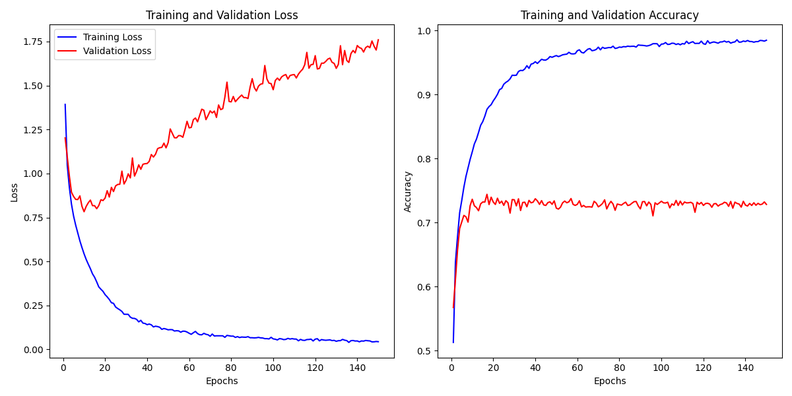
### CNN1_Droprate_0.5
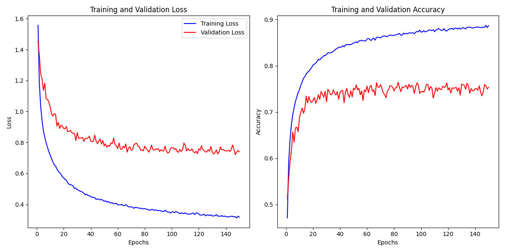
### CNN1_Droprate_0.8
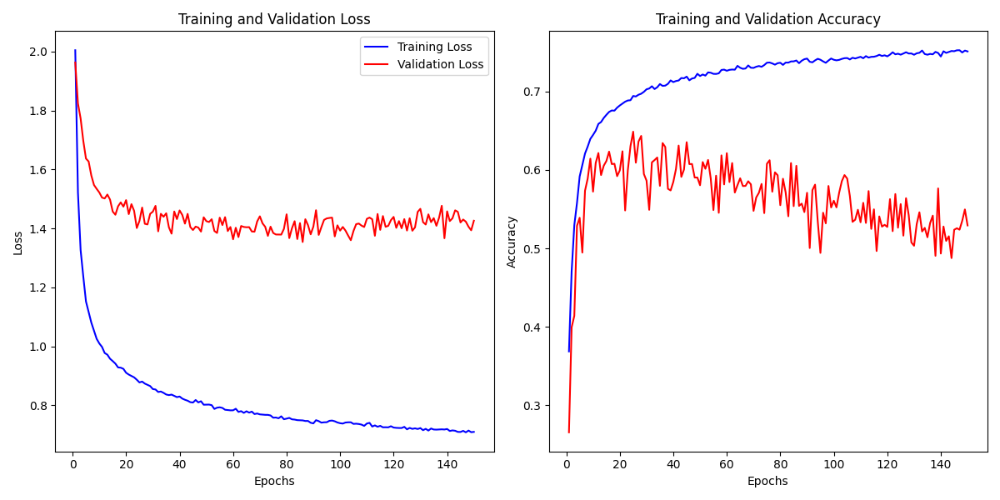


### CNN1_Droprate_0.1
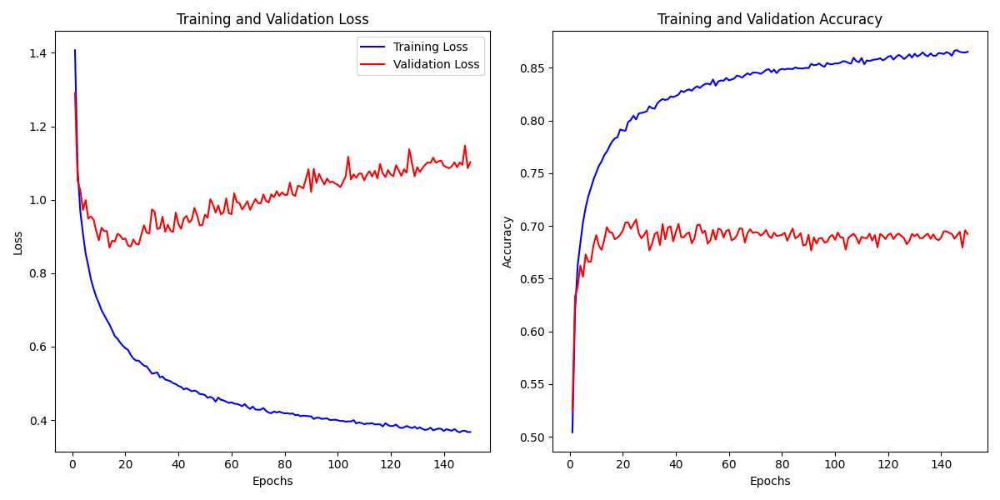
### CNN1_Droprate_0.5
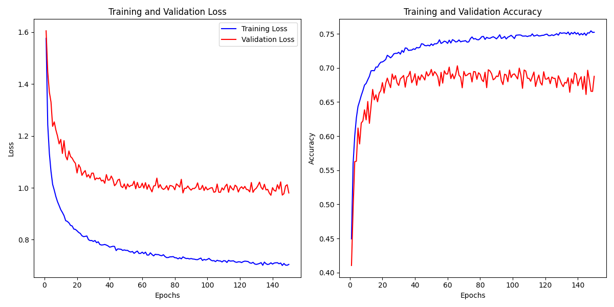
### CNN1_Droprate_0.8
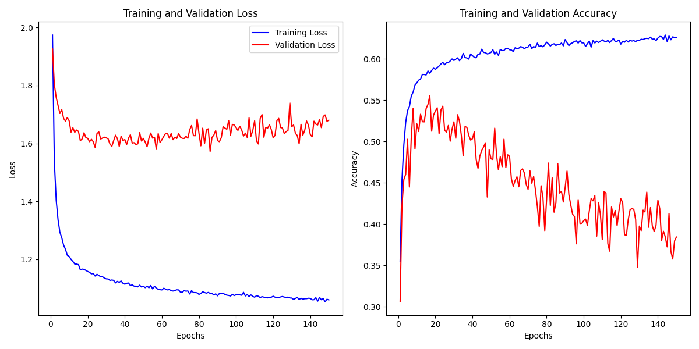

### MLP_Droprate_0.1
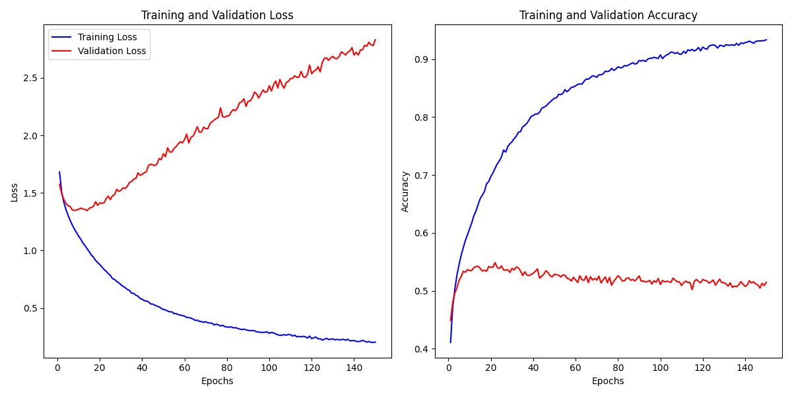
### MLP_Droprate_0.5
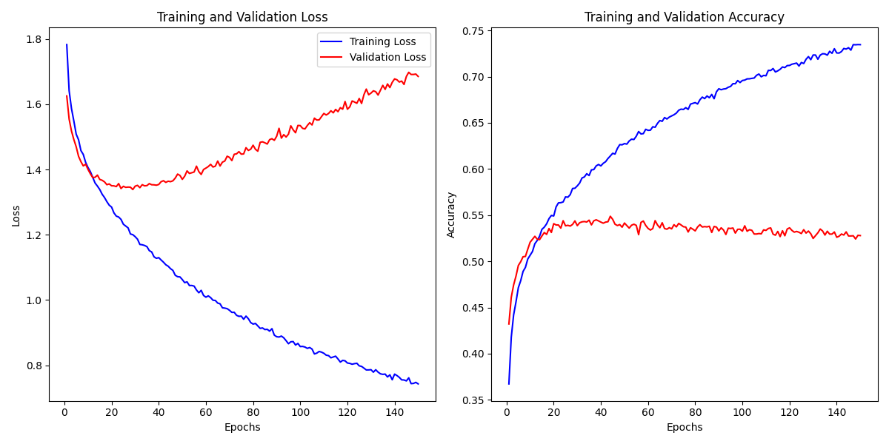
### MLP_Droprate_0.8
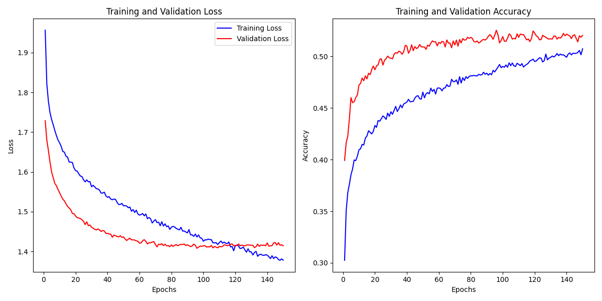

## 3.Training Loss & Validation Loss
Training loss是训练过程中通过梯度下降不断优化的目标函数，在合理训练轮数内大致会逐渐减小，使得模型不断fit训练数据集。而Validation loss是使用每轮模型权重在验证集上跑出来的结果，并非训练目标，因此它反应着模型是否真正学习到了数据特征并且能在非训练集上适用，反映了模型每轮的训练效果与泛化性。

当Training loss逐渐收敛但是Validation loss还在大幅波动或者过高都说明模型在训练集上过拟合了，不具备提取特征的能力。因此在这种情况下我一般会选择增大dropout rate来提升模型泛化性，或者直接更改模型架构的参数，例如卷积核大小，池化层核大小等参数来使得模型扩大学习范围。而二者均能很好收敛则表明模型能够理解数据特征并基于此完成分类任务。

## 4.Test Accuracy & Loss

### Accuracy
|Arch\Droprate|0.0|0.1|0.5|0.8|
|-|-|-|-|-|
|CNN1|0.7302999|0.7368001|0.7544002|0.64999986|
|CNN2|0.69|0.6987|0.7017|0.5572001|
|MLP|0.5333|0.53440005|0.5423999|0.51390004|
### Loss
|Arch\Droprate|0.0|0.1|0.5|0.8|
|-|-|-|-|-|
|CNN1|0.92254996|0.83401453|0.7490319|1.4224406|
|CNN2|0.9566318|0.8999781|0.9854722|1.6108093|
|MLP|1.3727223|1.4130517|1.339001|1.392171|

无论训练超参变化，在测试集分类准确率与损失率上CNN模型明显优于MLP模型，对于图像识别来说卷积核能够更好捕捉局部图像特征并进行学习，并且CNN参数量明显少于MLP，训练成本更低。

而相较CNN2，拥有更大卷积核与线性层的CNN2准确率更高，表现更好，适当范围内更大的卷积核能让模型获取到更多局部信息，提取整合出更加全面的特征。

而对不同训练参数，droprate设置在0.5能够使模型表现最好：这样居中的参数设置使得模型在训练集上能很好收敛并且具有泛化性，避免模型在训练集出现overfit的情况，让其在测试集上也能有很好表现。

## 5.&6.Ablation Study

### CNN1 without dropout
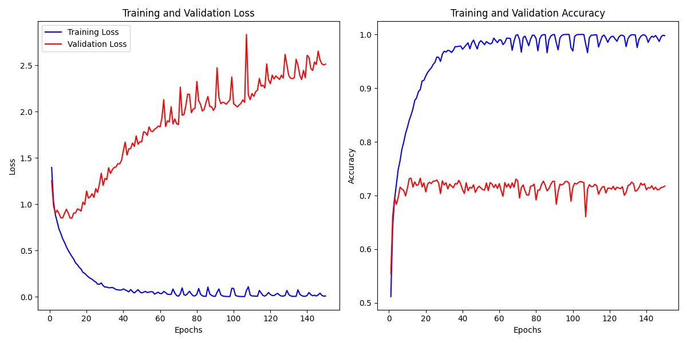
### MLP without dropout
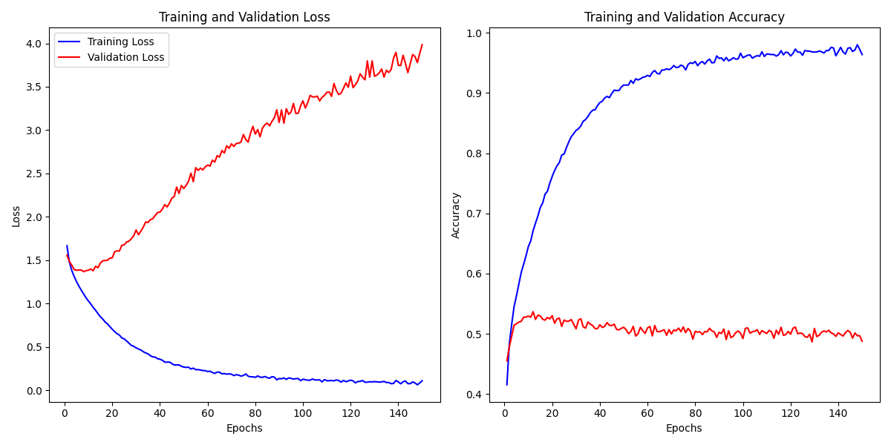

|Test|Accuracy|Loss|
|-|-|-|
|CNN1_DR_0.5|0.7544002|0.7490319|
|CNN1_woDO|0.7302999|0.92254996|
|MLP_DR_0.5|0.5423999|1.339001|
|MLP_woDO|0.5333|1.3727223|


当去掉dropout后，训练过程中模型在训练集上的表现很好，loss趋近0且accuracy趋近1；这样在训练集上过高的拟合会使得模型在验证集上大幅波动，并且最终测试表现也不如dropout存在时优秀。


### CNN1 without BatchNorm
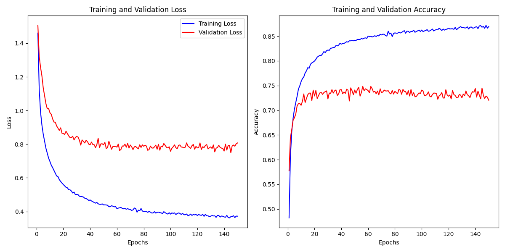
### MLP without BatchNorm
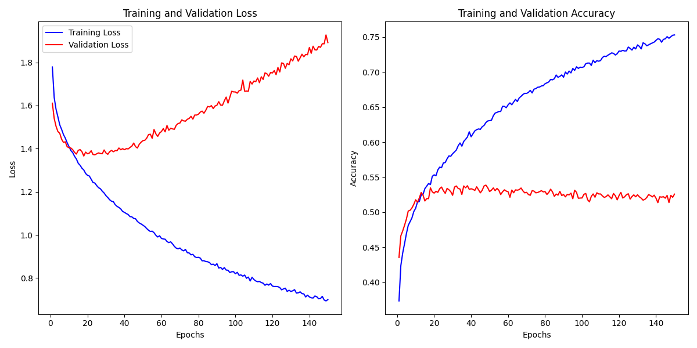

|Test|Accuracy|Loss|
|-|-|-|
|CNN1|0.7544002|0.7490319|
|CNN1_woBN|0.74469984|0.77878296|
|MLP|0.5423999|1.339001|
|MLP_woBN|0.5288001|1.4157593|

droprate设置为0.5，在去掉BatchNorm层后测试准确率明显低于原架构，损失率明显升高。并且从训练曲线可以看出，尽管模型在验证集上loss已经持续升高，但并未在训练集上完全收敛，这一点在MLP中尤其突出。

因此，BatchNorm的主要作用是通过控制输入数据的分布来使得模型能够稳定的收敛，同时正则化效果能够防止模型在训练集上过拟合，增加模型泛化能力。